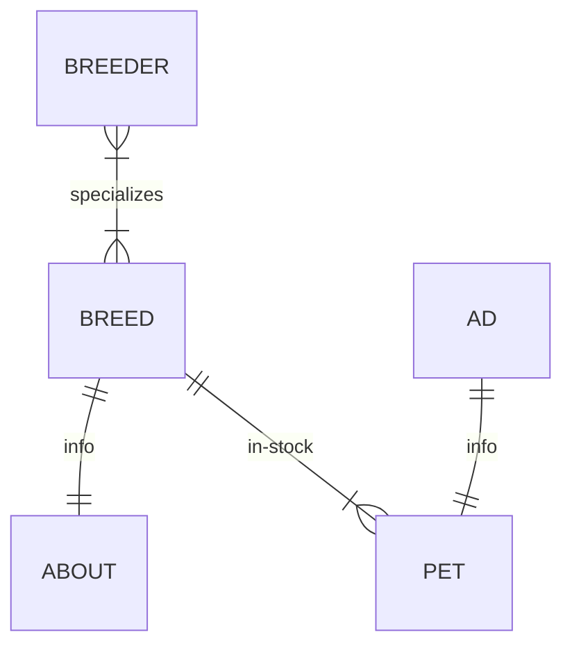

# Технический Анализ  
Цель документа выявить трудности, необходимые технологии связанные с реализацией требований.  
  
Указанные технологии являются заменяемыми.  
# Сторис  
Интерактивный видео контент от заводчиков к покупателям  
## Хранение и загрузка видео  
Видео хранилище уверенно будет набирать терабайты. Как последствие:  
- Само хранение. За основу возьмём AWS. S3 с быстрым доступом, 5 ТБ будет обходиться в $115/месяц  
- отгружать видео которое не просматривалось дольше месяца в отдельный медленный архивный сервер. Архивный сервер на 40 ТБ будет около $100/месяц. Что делать с более старыми видео, решать через несколько лет.  
- оплата трафика видео. При условии 1000 активных пользователей, 2 минут просмотров в день (50 МБ). Около $130/месяц  
- Сервис кодировки декодировки видео для разных платформ мобильников. Пример: AWS Elemental MediaLive  
- CloudFront для повышения доступности данных с S3. Не обязателен пока кол-во активных пользователей в сутки ниже 1000.  
## Легальность Видео  
Есть прецеденты: Роскомнадзор принудительно закрывает платформы, из-за распространения запрещённых видео.  
- Необходима консультация с юристами  
- Составление договора полностью снимающее обязательства с владельца приложения (не освобождает от законов)  
- Интеграция защитных мер, сервисов / алгоритмов по анализу видео на запрещённый контент. Допустим AWS rekognition  
- Ручная проверка материала отмеченные алгоритмом как сомнительные  
## Видео редактор  
Необходимо избежать. Ограничиться минимальным: при загрузке провести перекодировку в единый формат, соотношение сторон  
## Воспроизведение  
- Перемотка  
- Звук  
- Метрика заинтересованности  
- Лайки  
- Описание и комментарии  
- Модерация комментариев владельцем видео  
## Продвижение  
- Теги и привязка ленты к ним  
- Алгоритм установки приоритетности (когда вышло, сколько лайков было, как быстро его пролистнули или посмотрели до конца...)  
## Вывод  
Сторис составят внушительный объем затрат. Ориентировочно 30% времени разработки, поддержки, и стоимости инфраструктуры
# Модерация публикаций  
Все, что пользователь (покупатель, заводчик) может опубликовать, должно иметь возможность:  
- Пожаловаться на содержание  
- Модерация с возможностью аутсорсить внешним поставщикам услуги: отдельная платформа с минимальным функционалом и интерфейсом  
- Модерируется все: профиль покупателя, профиль заводчика, страницы объявлений, сторисы, комментарии, фотографии, видео  
- Нарушающие видео и фото материалы должны оперативно убираться, или не публиковаться вовсе во избежание блокировок в Апп Сторах / Роскомнадзоре
# Защита от перегрузок  
- CloudFront для защиты от спама на вебсервис  
- API Rates Limiter привязанные к пользователю  
- Кэширование поисков и результатов  
- СМС проверка при регистрации  
- Мониторинг за критическими точками: кол-во регистраций в час,  запросов к поиску, и т.д.  
# Технологии  
Технологии для реализации основного продукта, которые не были указаны выше.  
## База
Postgres для метадаты. Выбор основан на:  
- структурированные данные для хранения  
- связи (отношения) между видами данных. Диаграмма заводчик (breeder):  

- Открытая разработка, без лицензий, корпорации России активно переходят на неё  
## Веб сервис  
aiohttp подойдёт по многим критериям:  
- лёгкость масштабирования, и изначально высокая производительность  
- возможность всегда найти специалиста за счёт популярности технологии  
- в основе заложена методика программирования async которая стала золотым стандартом для веб серверов  
## Фронт  
React Native оптимален для создания мобильных веб приложений с единой базой кода для всех видов устройств (iOS, Android). С поддержкой в будущее, даже свежие, как HarmonyOS (Huawei).  
## Кэш  
Продуманно подойти к кэшированию сторис лент, ведь они для каждого участника могут быть уникальны, но при этом нельзя каждую секунду запрашивать у сервера составить и предоставить массив сторисов. Кэш остальных разделов приложения задача проще.  
  
Первоначально, больше всего подходят GraphQL для работы с разношёрстными запросами и Redis для кэшировать.  
## Инфраструктура  
Нужен дальнейший анализ конкурентов, пока что остановился на cloud.ru (Сбер) из-за обилия доступных сервисов в сравнении с Яндекс, и низкими ценами.  
  
На первой стадии, для экономии финансов можно без облака: арендовать один железный сервер стоимостью около $250/месяц.  Должно хватить на 100+ конкурентых пользователей в пике, а это 1000+ активных в сутках.
В таком случае:  
- Компоненты (сервисы) должны  не зависеть друг от друга. В таком случае, их можно оперативно разделить на облачные сервисы при необходимости.  
- Дополнительное внимание уделить резервным копиям, и мониторингу жизненных показателей
